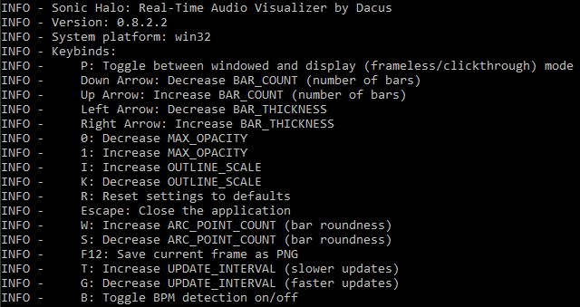

# Sonic Halo: Cross-Platform Real-Time Audio Visualizer

A beautiful, real-time audio visualizer that works on Windows, Linux, and macOS. Features circular and linear display modes, system audio capture, and customizable visual effects.



## ✨ Features

- **Cross-Platform**: Runs on Windows, Linux, and macOS
- **System Audio Capture**: Visualize any audio playing on your system
- **Multiple Display Modes**: Circular and linear visualization modes
- **Real-Time Processing**: High-performance audio analysis with OpenGL rendering
- **Customizable**: Adjustable colors, sensitivity, bar count, and visual effects
- **System Tray Integration**: Minimize to system tray (Windows/Linux)
- **BPM Detection**: Real-time beat detection
- **Song Information**: Display currently playing song (Windows)
- **Click-Through Mode**: Overlay mode for desktop backgrounds

## 🚀 Quick Start

### Automatic Setup (Recommended)

1. **Clone the repository:**
   ```bash
   git clone <repository-url>
   cd audio_vis
   ```

2. **Run the platform-specific setup:**

   **Windows:**
   ```cmd
   setup_windows.bat
   ```

   **Linux:**
   ```bash
   chmod +x setup_linux.sh
   ./setup_linux.sh
   ```

   **macOS:**
   ```bash
   chmod +x setup_macos.sh
   ./setup_macos.sh
   ```

3. **Launch the application:**
   ```bash
   python sonic_halo_launcher.py
   ```

### Manual Installation

If you prefer manual setup:

1. **Install Python 3.8+ and pip**

2. **Install system dependencies:**

   **Windows:**
   - No additional system dependencies required

   **Linux (Ubuntu/Debian):**
   ```bash
   sudo apt-get install pulseaudio pulseaudio-utils python3-pyqt5 python3-opengl
   ```

   **Linux (Fedora/CentOS):**
   ```bash
   sudo dnf install pulseaudio pulseaudio-utils python3-PyQt5 python3-pyopengl
   ```

   **macOS:**
   ```bash
   brew install python3 portaudio
   # Optionally install BlackHole for system audio:
   brew install blackhole-2ch
   ```

3. **Create virtual environment and install Python dependencies:**
   ```bash
   python -m venv venv
   source venv/bin/activate  # On Windows: venv\Scripts\activate
   pip install -r requirements.txt
   ```

## 🎵 System Audio Capture Setup

### Windows
- **Automatic**: Uses WASAPI loopback (no setup required)
- **Fallback**: Install [VB-Cable](https://vb-audio.com/Cable/) or enable Stereo Mix

### Linux (PulseAudio)
- **Automatic**: Setup script configures PulseAudio virtual sink
- **Manual**: 
  ```bash
  # Create virtual sink
  pactl load-module module-null-sink sink_name=sonic_halo_null
  # Set as default output or use pavucontrol to redirect audio
  ```

### macOS
- **Requirement**: Install [BlackHole](https://github.com/ExistentialAudio/BlackHole) or Soundflower
- **Setup**: Create a Multi-Output Device in Audio MIDI Setup including your speakers and BlackHole

## 🎮 Controls

| Key | Action |
|-----|--------|
| `P` | Toggle between windowed and display (overlay) mode |
| `↑`/`↓` | Increase/decrease number of bars |
| `←`/`→` | Decrease/increase bar thickness |
| `0`/`1` | Decrease/increase opacity |
| `I`/`K` | Increase/decrease outline scale |
| `W`/`S` | Increase/decrease bar roundness |
| `Q`/`A` | Increase/decrease minimum bar height |
| `E`/`D` | Increase/decrease marker offset |
| `R` | Reset settings to defaults |
| `T` | Toggle square/circular mode |
| `Esc` | Exit application |

## 🔧 Configuration

Settings are automatically saved in:
- **Windows**: `%APPDATA%\Dacus\Sonic Halo\settings.json`
- **Linux**: `~/.local/share/Sonic Halo/settings.json`
- **macOS**: `~/Library/Application Support/Sonic Halo/settings.json`

Key settings:
- `BAR_COUNT`: Number of frequency bars (1-64)
- `HEIGHT_SENSITIVITY`: Audio sensitivity multiplier
- `BAR_MAX_HEIGHT`: Maximum bar height (0.1-1.0)
- `USE_SYSTEM_AUDIO`: Enable system audio capture
- `USER_AUDIO_DEVICE`: Specific audio device name

## 🏗️ Project Structure

```
audio_vis/
├── src/
│   ├── pyqt5_audio_visualiser_optimise.py  # Main application
│   ├── cross_platform_tray.py              # Cross-platform system tray
│   ├── cross_platform_audio.py             # Audio device detection
│   └── winnotifyicon.py                     # Windows-specific tray
├── media/                                   # Icons and assets
├── requirements.txt                         # Python dependencies
├── sonic_halo_launcher.py                   # Cross-platform launcher
├── setup_windows.bat                        # Windows setup
├── setup_linux.sh                          # Linux setup
└── setup_macos.sh                          # macOS setup
```

## 🐛 Troubleshooting

### No Audio Input Detected
- **Windows**: Check if WASAPI loopback is working, install VB-Cable as fallback
- **Linux**: Ensure PulseAudio is running, check `pavucontrol` for virtual sink
- **macOS**: Install and configure BlackHole or Soundflower

### Performance Issues
- Lower the `BAR_COUNT` setting
- Reduce `CHUNK` size in settings
- Close other graphics-intensive applications

### System Tray Not Working
- **Linux**: Ensure your desktop environment supports system tray
- **Windows**: Check if Windows notification area is enabled

### Window Click-Through Issues
- Currently only supported on Windows
- Linux/macOS use standard windowing (no click-through yet)

## 📋 Dependencies

### Core Dependencies
- Python 3.8+
- NumPy
- PyQt5
- PyOpenGL
- SoundDevice

### Platform-Specific
- **Windows**: pyaudiowpatch, winsdk, pywin32
- **Linux**: PulseAudio, pactl
- **macOS**: BlackHole/Soundflower (optional)

## 🤝 Contributing

1. Fork the repository
2. Create a feature branch: `git checkout -b feature-name`
3. Make your changes and test on multiple platforms
4. Submit a pull request

## 📄 License

This project is licensed under the MIT License.

## 🙏 Acknowledgments

- VB-Audio for VB-Cable (Windows)
- BlackHole project for macOS audio routing
- PulseAudio community for Linux audio support
   git clone <repository-url>
   cd audio_visualizer
   ```

2. Make a new virtual environment (optional):
   ```
   python -m venv .venv
   ```

3. Enter the virtual environment (optional):
   ```
   .venv\Scripts\activate.bat
   ```

4. Install the required dependencies:
   ```
   pip install -r requirements.txt
   ```

## Usage

To run the audio visualizer, execute the following command from root of the repository:

```
python src/pyqt5_audio_visualiser_optimise.py
```

Hotkeys and their effects are listed in the command line

## Features

- Real-time audio visualization with animated bars.
- Key-bind interface for dynamic control of the visualizer.
- Adjustable settings for audio processing and visualization.
- Saved settings and window positions in user %localappdata%

## Contributing

Contributions are welcome! If you have suggestions or improvements, please open an issue or submit a pull request.